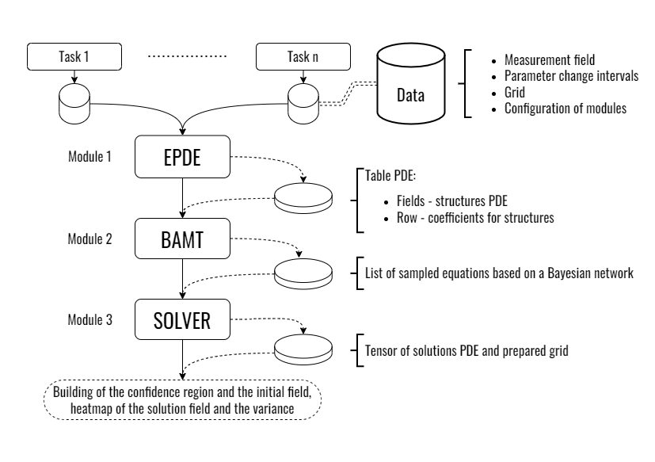
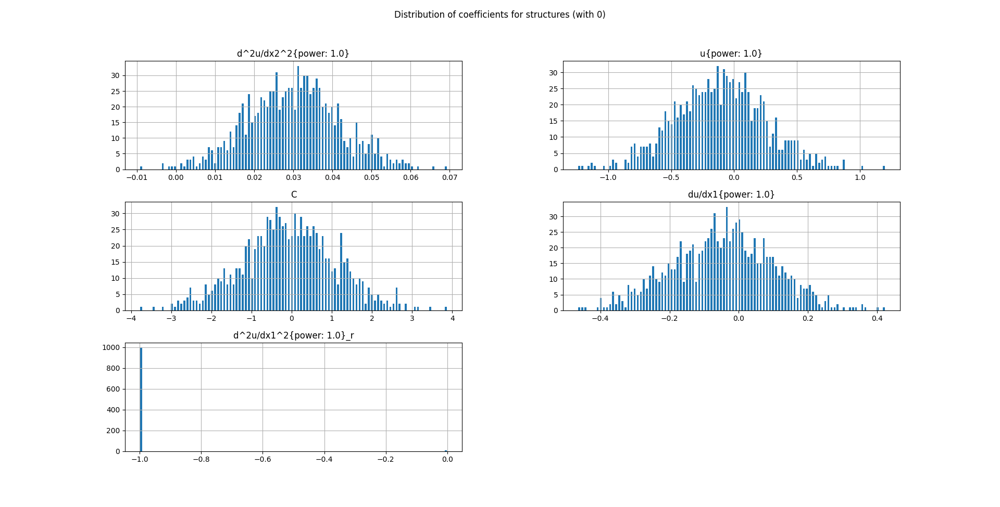
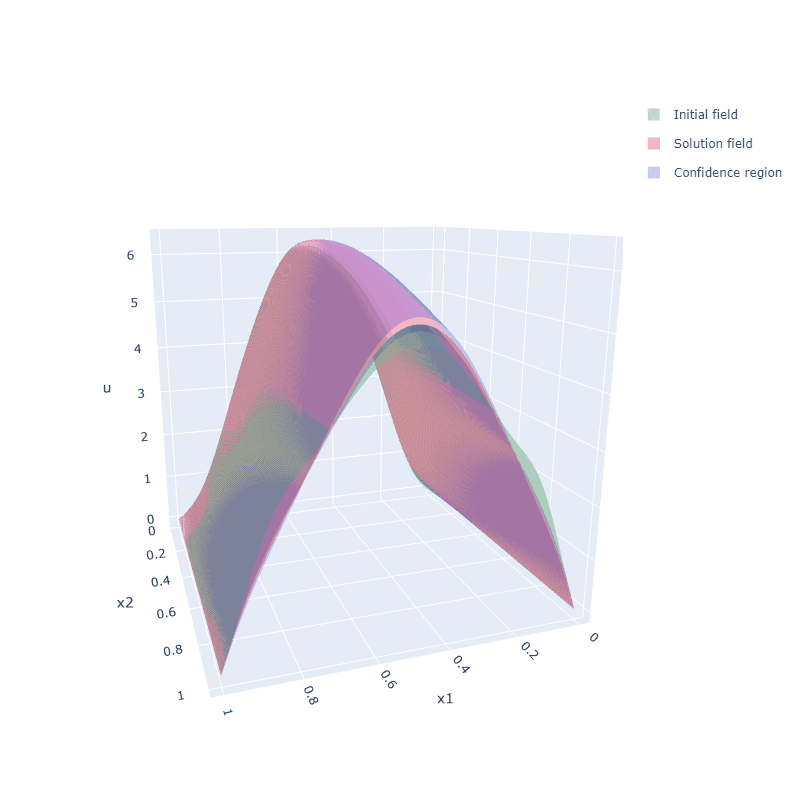
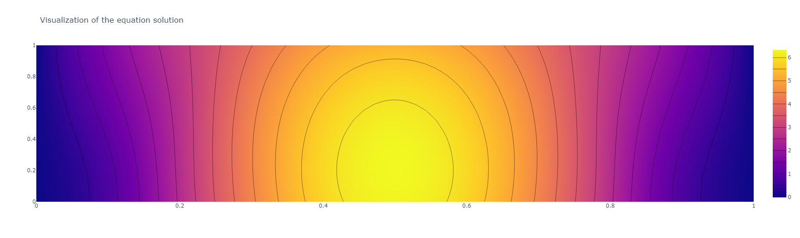
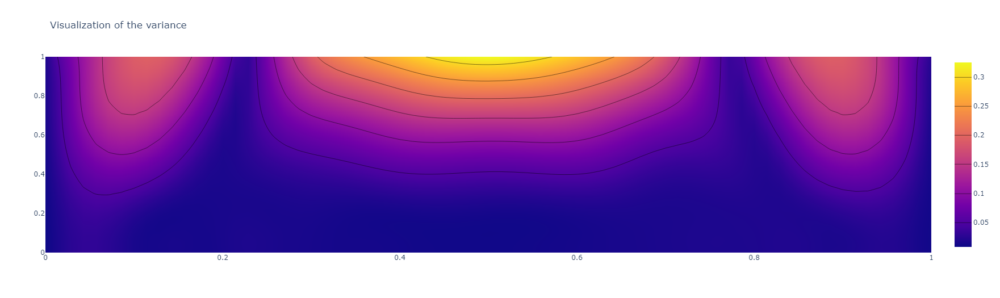
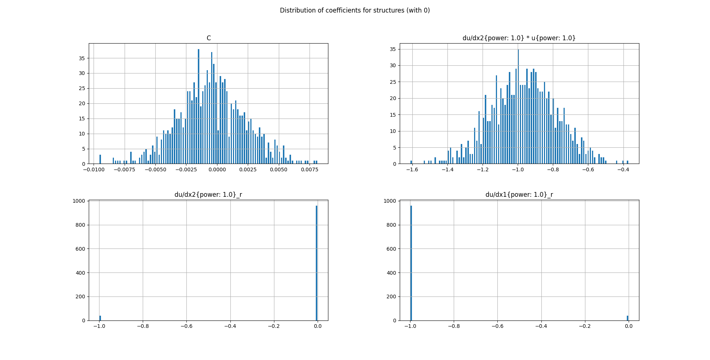
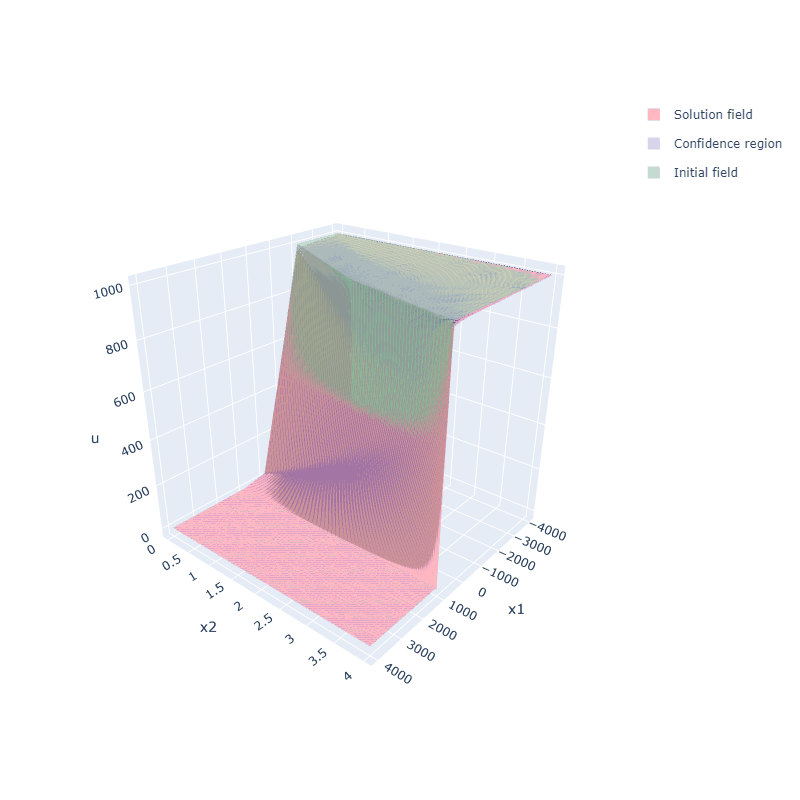
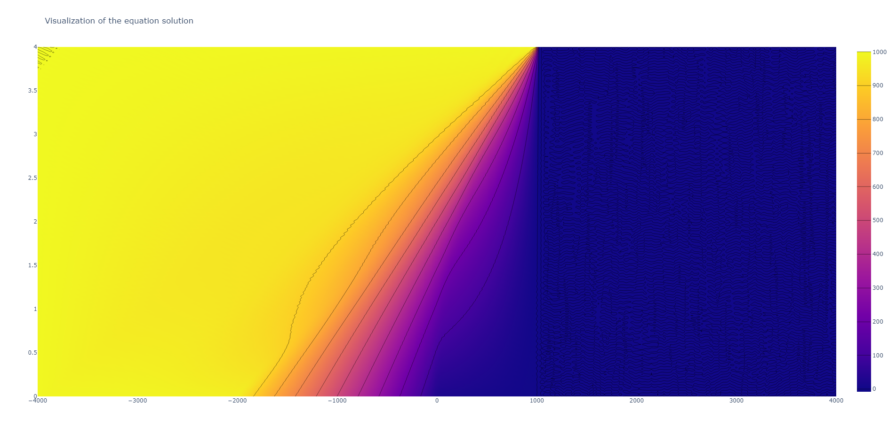
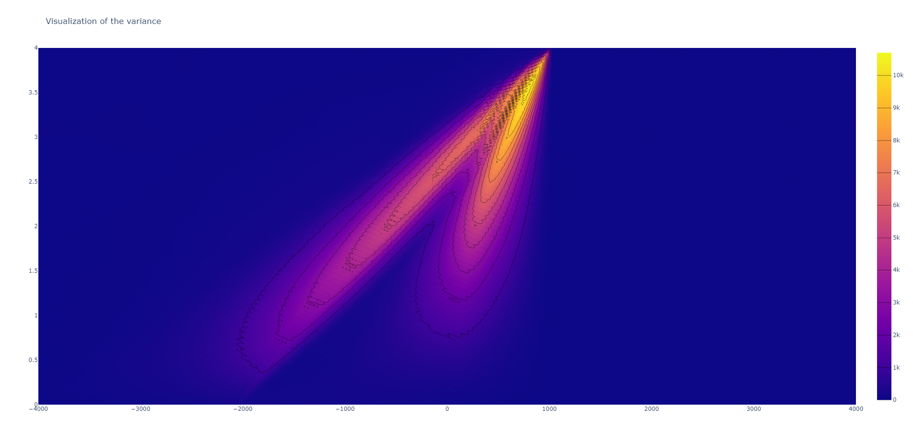

# Robust-EPDE

---
Program complex for robust training of models in the form of differential equations.
---

### The algorithms used:

- EPDE (Evolutionary Partial Differential Equations). Algorithm for the search of differential equations based on data (https://github.com/ITMO-NSS-team/EPDE)
- BAMT (Bayesian Analytical and Modelling Toolkit). Repository of a data modeling and analysis tool based on Bayesian networks. (https://github.com/aimclub/BAMT)
- TEDEouS (Torch Exhaustive Differential Equation Solver). Algorithm for automated solution of differential equations based on neural networks (https://github.com/ITMO-NSS-team/torch_DE_solver)



---
## Examples & Tutorials

Before starting the program component, the configuration of each module must be set up. This is done for each task separately in the folder `tasks/`. The file should be named `tasks/example_{title}.py`. Where all additional functions are implemented, starting with `def load_data():`
```Python
    def load_data():
    """
        path -> data -> parameters -> derivatives (optional) -> grid -> 
        -> boundary conditions (optional) -> modules config (optional)
    """
    path = """YOUR CODE HERE"""
    data = """YOUR CODE HERE"""

    derives = None  # if there are no derivatives

    grid = """YOUR CODE HERE"""
    params = """YOUR CODE HERE"""
    
    domain = """YOUR CODE HERE"""
    boundaries = False  # if there are no boundary conditions

    noise = False
    variance_arr = ["""YOUR CODE HERE"""] if noise else [0]

    global_modules = {
        "global_config": {
            "discovery_module": "EPDE",
            "dimensionality": # (starts from 0 - [t,], 1 - [t, x], 2 - [t, x, y])
        }
    }

    epde_config = {"""YOUR CODE HERE"""}

    bamt_config = {"""YOUR CODE HERE"""}

    solver_config = {"""YOUR CODE HERE"""}

    config_modules = {**global_modules,
                      **epde_config,
                      **bamt_config,
                      **solver_config}

    with open(f'{path}config_modules.json', 'w') as fp:
        json.dump(config_modules, fp)

    cfg_ebs = config_modules.Config(f'{path}config_modules.json')

    return data, grid, derives, cfg_ebs, domain, params, boundaries
```

The default configuration and corresponding parameters of each module can be viewed in `default_configs.py`. The task instructions are then added to the main `ebs_main.py` file:
```Python
tasks = {
    'wave_equation': example_wave_equation
}

title = list(tasks.keys())[0] # name of the problem/equation
```

### Results

<details>
<summary>1. Wave equation with one spatial variable (more) </summary>

```math 
\frac{\partial^{2} u}{\partial t^{2}} - \frac{1}{25} \frac{\partial^{2} u}{\partial x^{2}} = 0,
```
```math 
\\ 100\times100, x \in [0; 1], t \in [0; 1].
```
The output of the `EPDE` module is presented in the form of a table. The fields in the table are the structures of the obtained partial differential equations, where each row contains the coefficients at each structure. 

These data are input to the `BAMT` module to build a Bayesian network based on them. 
The results of the module are: 
* distribution of coefficients at structures (illustrated in the figure below)
 
* list of sampled partial differential equations, which in turn is the input to the `SOLVER` module.

The resulting solution fields of partial differential equations are used to construct a confidence region and an average solution. The results are displayed for comparison with the original data and as heat maps.





</details>

<details>
<summary>2. Burgers' equation </summary>
<br>

```math 
\frac{\partial u}{\partial t} +  u \frac{\partial u}{\partial x} = 0,
```
```math 
\\ 256\times256, x \in [-4000; 4000], t \in [0; 4].
```







</details>


---
